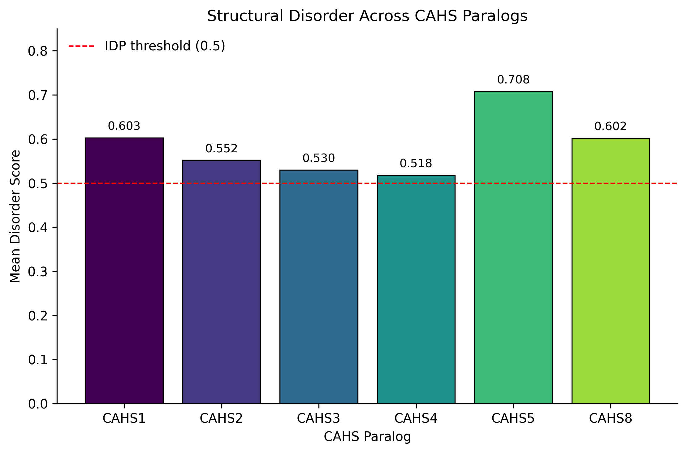
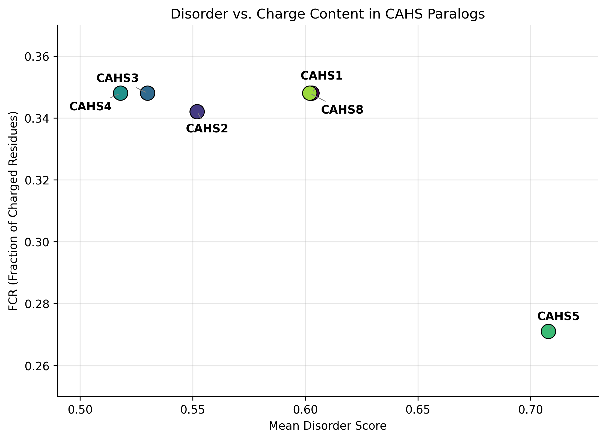
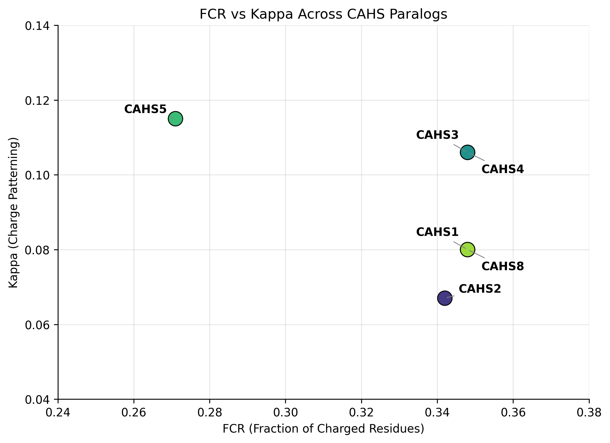

# Tardigrade CAHS Protein Analysis

## Computational analysis of intrinsic disorder and charge properties in Hypsibius exemplaris CAHS proteins

This repository contains a reproducible computational pipeline analyzing 
**Cytosolic Abundant Heat Soluble (CAHS)** proteins in the tardigrade 
*Hypsibius exemplaris*, focusing on intrinsic structural disorder and 
charge patterning as candidate mechanisms behind their extreme stress tolerance.

📝 **Read the full narrative and biological interpretation on my blog:**  
[Why Tardigrades Are a Playground for Genomicists](https://sajjadomics.com/2026/07/07/why-tardigrades-are-a-playground-for-genomicists-a-quick-computational-look-at-their-disordered-stress-proteins/)

🔬 **Run the analysis interactively on Google Colab:**  
[Open in Colab](https://colab.research.google.com/drive/1Oay2f6gWBQoo98Iw8sI7V7UX1WO_cH9t)

---

## Background

Tardigrades are microscopic invertebrates capable of surviving extreme 
desiccation, radiation, and freezing through a process called cryptobiosis. 
One key group of proteins implicated in this resilience is the 
**CAHS (Cytosolic Abundant Heat Soluble)** family — intrinsically disordered 
proteins thought to form protective gel-like matrices during dehydration.

This project asks: **do all CAHS paralogs share similarly high disorder and 
charge properties, or do they diverge functionally?**

Six CAHS paralogs from *Hypsibius exemplaris* were retrieved from UniProt 
and analyzed computationally.

## Sequences Analyzed

| Protein | UniProt ID | Length (aa) |
|---------|-----------|--------------|
| CAHS1   | P0CU45    | 227          |
| CAHS2   | P0CU46    | 237          |
| CAHS3   | P0CU43    | 224          |
| CAHS4   | P0CU44    | 224          |
| CAHS5   | P0CU47    | 414          |
| CAHS8   | P0CU50    | 227          |

## Methods

- **Data source:** UniProtKB (*Hypsibius exemplaris* CAHS proteins)
- **Disorder prediction:** [metapredict](https://github.com/idptools/metapredict)
- **Charge analysis:** [localCIDER](http://pappulab.github.io/localCIDER/) — 
  Net Charge Per Residue (NCPR), Fraction of Charged Residues (FCR), 
  and charge patterning parameter (kappa, κ)
- **Visualization:** matplotlib

Pipeline steps:
1. Parse sequences with Biopython
2. Predict per-residue disorder scores and compute average disorder per protein
3. Calculate NCPR, FCR, and kappa for each sequence
4. Generate comparative visualizations across paralogs

## Key Results

| Protein | Avg. Disorder | NCPR   | FCR   | Kappa |
|---------|---------------|--------|-------|-------|
| CAHS1   | 0.603         | -0.022 | 0.348 | 0.080 |
| CAHS2   | 0.552         | -0.021 | 0.342 | 0.067 |
| CAHS3   | 0.530         | -0.036 | 0.348 | 0.106 |
| CAHS4   | 0.518         | -0.036 | 0.348 | 0.106 |
| CAHS5   | 0.708         | -0.019 | 0.271 | 0.115 |
| CAHS8   | 0.602         | -0.022 | 0.348 | 0.080 |

**Main finding:** CAHS5 stands out as a clear outlier — it is nearly twice 
the length of the other paralogs (414 aa), shows the highest intrinsic 
disorder (0.708), and has the lowest fraction of charged residues (0.271). 
The remaining five paralogs cluster tightly, suggesting a conserved 
disordered "core" architecture with CAHS5 representing a functionally 
divergent family member.

### Structural Disorder Across CAHS Paralogs

### Disorder vs. Charge Content

### Charge Patterning (FCR vs Kappa)

## Repository Structure

tardigrade-CAHS-analysis/
├── data/
│   └── raw/
│       └── cahs_sequences.fasta
├── scripts/
│   └── cahs_analysis.py
├── results/
│   └── figures/
│       ├── disorder_barchart_final.png
│       ├── disorder_fcr_scatter_fixed.png
│       └── fcr_kappa_scatter_fixed.png
├── requirements.txt
├── LICENSE
└── README.md

## How to Reproduce

git clone https://github.com/seyedsajjad98/tardigrade-CAHS-analysis.git
cd tardigrade-CAHS-analysis
pip install -r requirements.txt
python scripts/cahs_analysis.py

Output plots will be saved to results/figures/.

## References

- Boothby, T. C., et al. (2017). Tardigrades Use Intrinsically Disordered Proteins to Survive Desiccation. Molecular Cell, 65(6), 975–984.
- Yagi-Utsumi, M., et al. (2021). Desiccation-induced fibrous condensation of CAHS protein from an anhydrobiotic tardigrade. Scientific Reports.
- UniProtKB — Hypsibius exemplaris CAHS protein entries.
- Blog post: sajjadomics.com — Why Tardigrades Are a Playground for Genomicists

## License

This project is licensed under the MIT License — see the LICENSE file for details.

## Contact

Sajjad Haghi
GitHub: https://github.com/seyedsajjad98
LinkedIn: https://linkedin.com/in/sajjad-haghi-96a1ba209/
`
